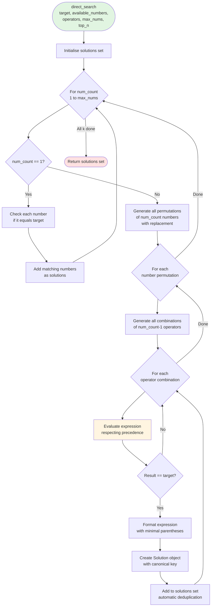
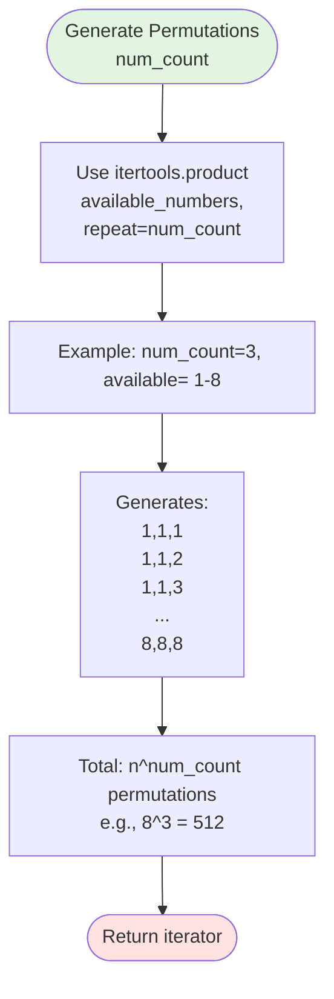
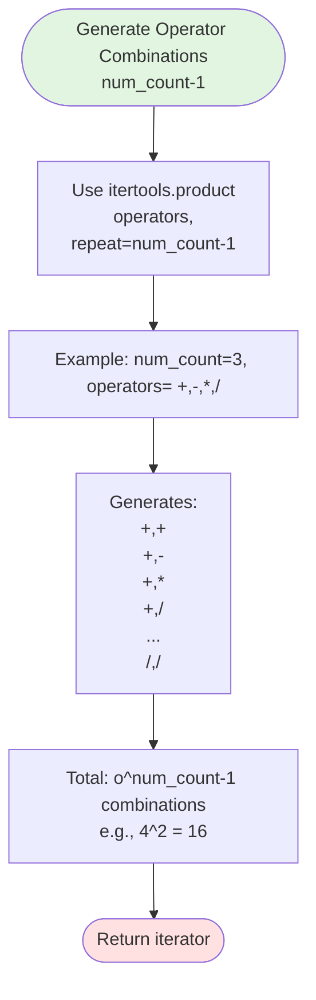
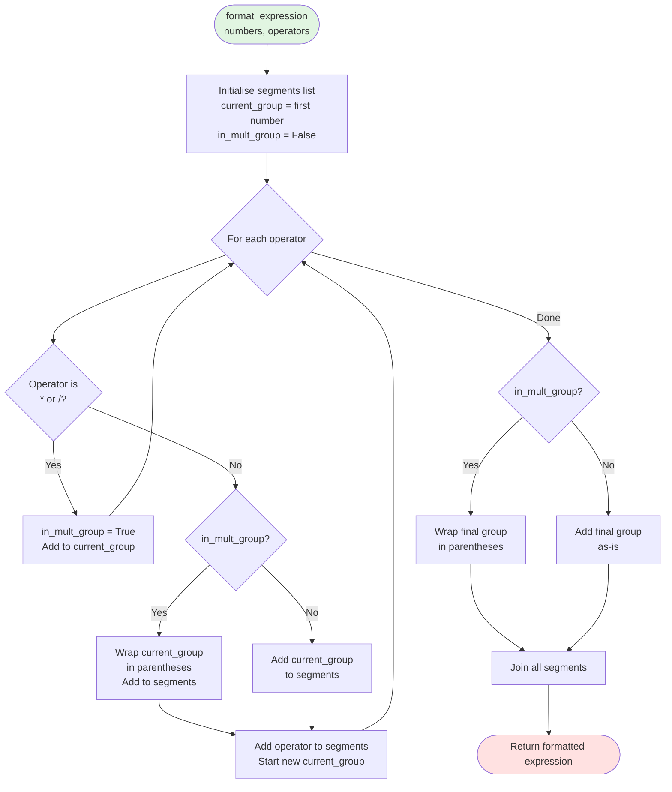

# Direct Search Algorithm Flow

This flowchart details the direct search (brute force) algorithm. In practice, `find_solutions()` calls this algorithm when `num_count ≤ 4`, but the algorithm itself can handle any value of `max_nums`.

## Main Direct Search Flow



## Number Permutation Generation



## Operator Combination Generation



## Expression Evaluation Flow

See [Expression Evaluation](expression-evaluation.md) for detailed flow.

## Expression Formatting Flow



## Example Walkthrough

**Target:** 100, **k:** 3, **Available:** {1-8}, **Operators:** {+, -, *, /}

### Step 1: Generate Number Permutations

```
Sample permutations (out of 8^3 = 512):
[1, 1, 1]
[1, 1, 2]
...
[4, 5, 5]  ← Will find solution
...
[8, 8, 8]
```

### Step 2: Generate Operator Combinations

```
For each permutation, try all 4^2 = 16 operator combinations:
[+, +]
[+, -]
[+, *]  ← Will find solution with [4, 5, 5]
[+, /]
...
[/, /]
```

### Step 3: Evaluate Expression

```
Numbers: [4, 5, 5]
Operators: [+, *]

Evaluation (respecting precedence):
  Step 1: Handle * first
    5 * 5 = 25
    Numbers: [4, 25]
    Operators: [+]
  
  Step 2: Handle +
    4 + 25 = 29
  
Result: 29 ≠ 100 (not a solution)

---

Numbers: [4, 5, 5]
Operators: [*, *]

Evaluation:
  Step 1: Handle * (left to right)
    4 * 5 = 20
    Numbers: [20, 5]
    Operators: [*]
  
  Step 2: Handle remaining *
    20 * 5 = 100
  
Result: 100 == 100 ✓ (solution found!)
```

### Step 4: Format Expression

```
Numbers: [4, 5, 5]
Operators: [*, *]

Formatting:
  Start: "4"
  Operator *: in_mult_group = True, current_group = "4 * 5"
  Operator *: still in_mult_group, current_group = "4 * 5 * 5"
  End: in_mult_group = True, wrap in parentheses
  
Result: "(4 * 5 * 5)"
```

### Step 5: Create Solution

```python
Solution(
    expression="(4 * 5 * 5)",
    result=100,
    unique_nums=(4, 5),  # sorted unique
    op_count=2,
    _canonical="+4*5*5"  # computed in __post_init__
)
```

## Complexity Analysis

### Time Complexity

```
For num_count = k:
  Number permutations: n^k
  Operator combinations: o^(k-1)
  Evaluation per expression: O(k)
  
Total: O(n^k × o^(k-1) × k)
```

**Examples:**

| n | k | o | Permutations | Op Combos | Total | Time |
|---|---|---|--------------|-----------|-------|------|
| 8 | 1 | 4 | 8 | 1 | 8 | <1ms |
| 8 | 2 | 4 | 64 | 4 | 256 | <5ms |
| 8 | 3 | 4 | 512 | 16 | 8,192 | ~50ms |
| 8 | 4 | 4 | 4,096 | 64 | 262,144 | ~1s |

### Space Complexity

```
Storage:
  Current expression: O(k)
  Solutions set: O(|solutions|)
  
Total: O(k + |solutions|)
```

Typically: O(100) - O(10,000)

## When Direct Search is Used

**Called by `find_solutions()` when:**
- `num_count ≤ 4`

**Important:** The `direct_search()` function itself accepts any `max_nums` value and will search from 1 to `max_nums`. The threshold of 4 is a decision made by `find_solutions()` about *when* to call this function, not a limitation of the function itself.

**Rationale for the threshold:**
- Search space is manageable for k≤4 (≤ 262,144 expressions for k=4)
- Simple implementation
- No memory overhead for subexpressions
- Faster than meet-in-middle for small k due to lower overhead

**Crossover point:** k=4 is empirically determined as the point where meet-in-middle becomes more efficient.

## Optimisations Applied

1. **Early evaluation termination:** If evaluate_expression returns None (invalid), skip formatting
2. **Canonical deduplication:** Automatic via Solution set
3. **Minimal parenthesisation:** Only add parentheses when needed for precedence
4. **Iterator-based generation:** Uses itertools.product for memory efficiency

## Comparison with Meet-in-Middle

| Aspect | Direct Search | Meet-in-Middle |
|--------|--------------|----------------|
| **Time (k=4)** | O(n^4 × o^3) | O(n^2 × o) |
| **Time (k=6)** | O(n^6 × o^5) | O(n^3 × o^2) |
| **Space** | O(k) | O(n^(k/2) × o^(k/2-1)) |
| **Implementation** | Simple | Complex |
| **Best for** | k ≤ 4 | k > 4 |

**For k=4, n=8, o=4:**
- Direct: 8^4 × 4^3 = 262,144 (~1s)
- Meet-in-middle: 2 × 8^2 × 4 = 512 (~0.01s)

Even though meet-in-middle is faster, direct search is used for k≤4 because:
1. Implementation is simpler
2. Performance is acceptable (~1s)
3. No memory overhead
4. Code is easier to maintain

## See Also

- [Overall Flow](overall-flow.md) - Main algorithm flow
- [Expression Evaluation](expression-evaluation.md) - Evaluation details
- [Algorithm Overview](../algorithm-overview.md) - High-level explanation
- [Complexity Analysis](../complexity-analysis.md) - Performance details
