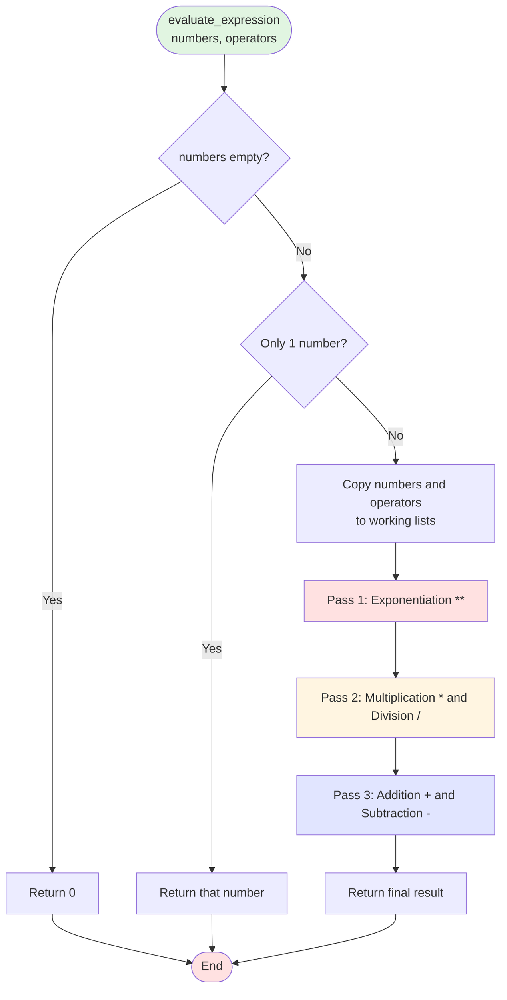
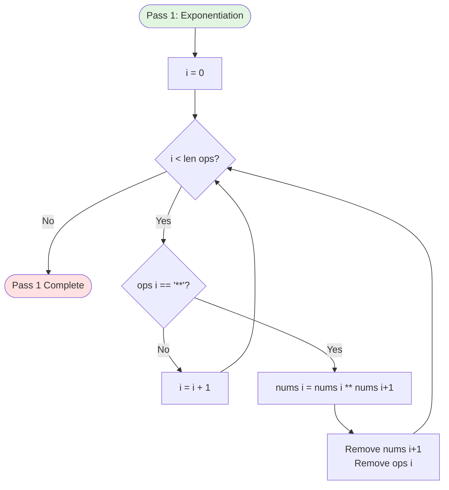
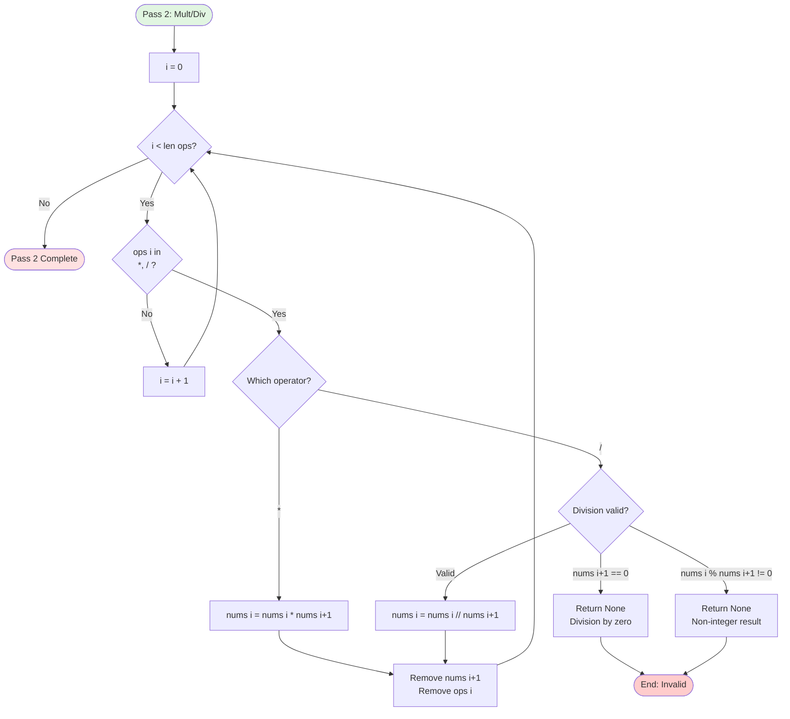
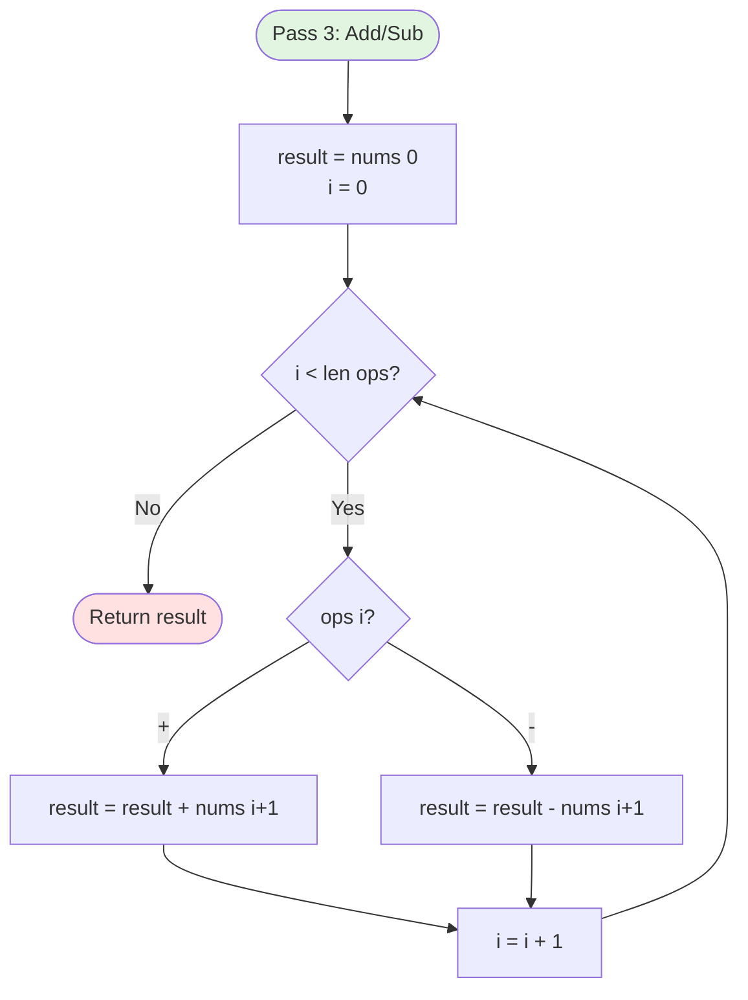
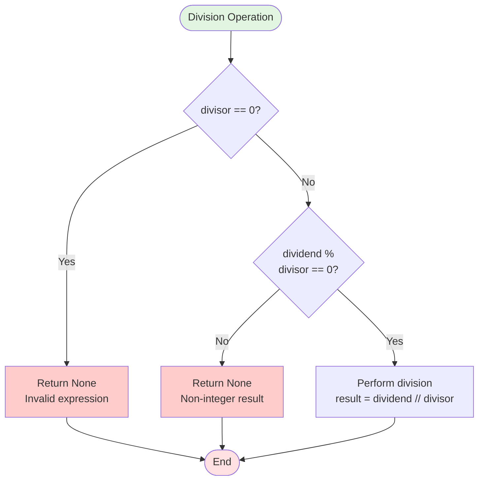

# Expression Evaluation Flow

This flowchart details how mathematical expressions are evaluated with correct operator precedence.

## Main Evaluation Flow



## Pass 1: Exponentiation (**)



**Example:**
```
Before: nums=[2, 3, 4], ops=['**', '+']
After Pass 1: nums=[8, 4], ops=['+']
  (2 ** 3 = 8)
```

## Pass 2: Multiplication and Division



**Example:**
```
Before: nums=[8, 4, 2], ops=['+', '/']
After Pass 2: nums=[8, 2], ops=['+']
  (4 / 2 = 2)

Invalid example:
nums=[7, 2], ops=['/']
7 % 2 != 0, so return None
```

## Pass 3: Addition and Subtraction



**Example:**
```
Before: nums=[8, 2, 5], ops=['+', '-']
Step 1: result = 8
Step 2: result = 8 + 2 = 10
Step 3: result = 10 - 5 = 5
Return: 5
```

## Complete Example Walkthrough

**Expression:** `2 + 3 * 4 ** 2`

**Input:**
```
numbers = [2, 3, 4, 2]
operators = ['+', '*', '**']
```

### Pass 1: Exponentiation

```
i=0: ops[0] = '+' (not **), i++
i=1: ops[1] = '*' (not **), i++
i=2: ops[2] = '**' ✓
  nums[2] = 4 ** 2 = 16
  Remove nums[3], ops[2]
  
After: nums=[2, 3, 16], ops=['+', '*']
```

### Pass 2: Multiplication/Division

```
i=0: ops[0] = '+' (not * or /), i++
i=1: ops[1] = '*' ✓
  nums[1] = 3 * 16 = 48
  Remove nums[2], ops[1]
  
After: nums=[2, 48], ops=['+']
```

### Pass 3: Addition/Subtraction

```
result = nums[0] = 2
i=0: ops[0] = '+' ✓
  result = 2 + 48 = 50
  
Return: 50
```

**Result:** `2 + 3 * 4 ** 2 = 50` ✓

## Operator Precedence Table

| Precedence | Operators | Associativity | Pass |
|------------|-----------|---------------|------|
| 1 (Highest) | `**` | Right-to-left* | Pass 1 |
| 2 | `*`, `/` | Left-to-right | Pass 2 |
| 3 (Lowest) | `+`, `-` | Left-to-right | Pass 3 |

*Note: Current implementation processes `**` left-to-right, which differs from standard mathematical convention. This could be updated if needed.

## Validation Checks

### Division by Zero



### Integer Division Requirement

**Why:** Beltmatic uses integer arithmetic only.

**Examples:**
```
8 / 2 = 4 ✓ (exact integer)
7 / 2 = 3.5 ✗ (not an integer, return None)
10 / 3 = 3.33... ✗ (not an integer, return None)
```

## Edge Cases

### Empty Expression

```
Input: numbers=[], operators=[]
Output: 0
```

### Single Number

```
Input: numbers=[42], operators=[]
Output: 42
```

### All Same Operator

```
Input: numbers=[2, 3, 4, 5], operators=['+', '+', '+']
Evaluation: 2 + 3 + 4 + 5 = 14
```

### Mixed Precedence

```
Input: numbers=[2, 3, 4, 5], operators=['+', '*', '-']
Expression: 2 + 3 * 4 - 5

Pass 1 (**: none
Pass 2 (*): 3 * 4 = 12
  → numbers=[2, 12, 5], operators=['+', '-']
Pass 3 (+, -):
  result = 2
  result = 2 + 12 = 14
  result = 14 - 5 = 9
  
Output: 9
```

## Complexity Analysis

### Time Complexity

```
Pass 1 (**: O(k) where k = number of operators
Pass 2 (*, /): O(k)
Pass 3 (+, -): O(k)

Total: O(k) = O(num_count - 1)
```

### Space Complexity

```
Working copies of numbers and operators: O(k)
```

## Implementation Notes

### Why Three Passes?

**Alternative:** Single pass with precedence checking

**Chosen approach:** Three passes for simplicity and clarity
- Easy to understand and maintain
- Correct precedence guaranteed
- Performance overhead is minimal (O(k) is fast)

### Why Modify Lists In-Place?

**Benefit:** Simulates the evaluation process naturally
- As we evaluate `3 * 4`, we replace it with `12`
- The list shrinks as we combine terms
- Final list has one element: the result

**Example:**
```
Start:    [2, 3, 4, 5] with ['+', '*', '-']
After *:  [2, 12, 5] with ['+', '-']
After +:  [14, 5] with ['-']
After -:  [9] with []
Result:   9
```

## See Also

- [Overall Flow](overall-flow.md) - Main algorithm flow
- [Direct Search Flow](direct-search-flow.md) - Direct search details
- [Algorithm Overview](../algorithm-overview.md) - High-level explanation
