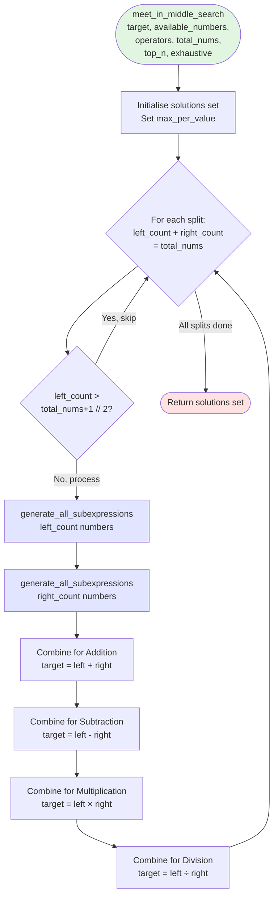
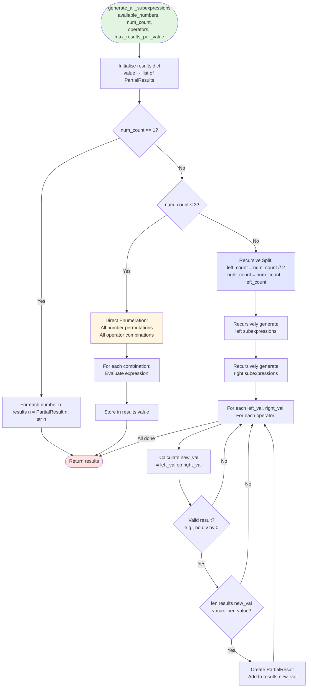
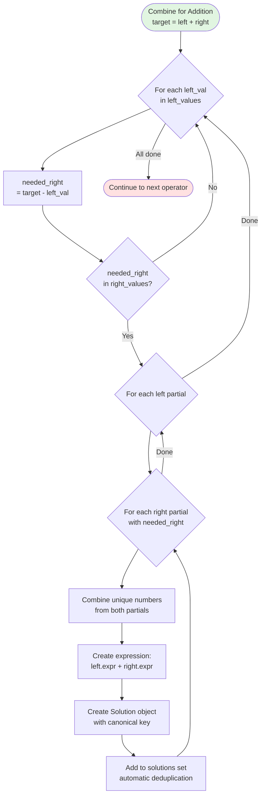
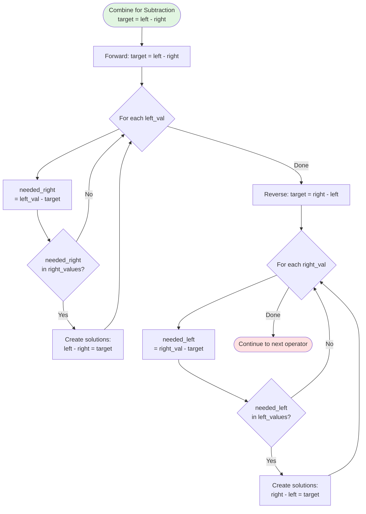
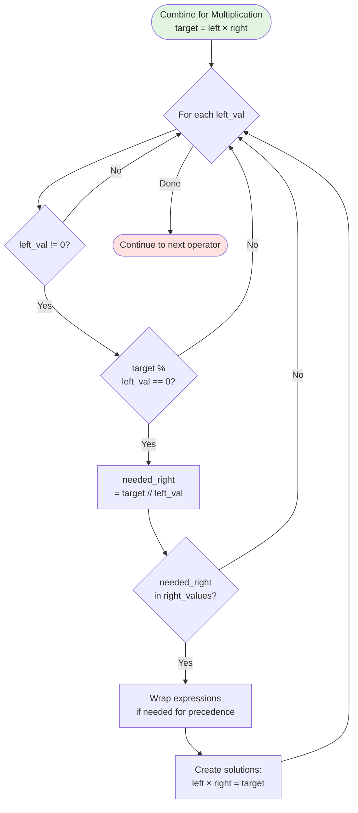
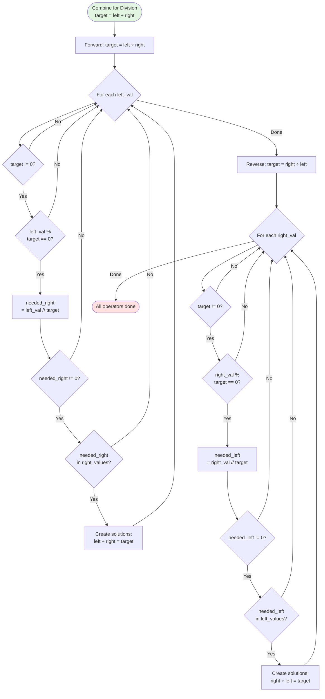

# Meet-in-the-Middle Algorithm Flow

This flowchart details the meet-in-the-middle search algorithm used for expressions with more than 4 numbers.

## Main Meet-in-Middle Flow



## Subexpression Generation Flow



## Addition Combination



## Subtraction Combination



## Multiplication Combination



## Division Combination



## Example Walkthrough

**Target:** 100, **k:** 6, **Available:** {1-8}, **Operators:** {+, -, *, /}

### Split: left=3, right=3

**Left subexpressions (sample):**
```
value → expressions
25 → ["(5 * 5)", "1 + 24", "2 + 23"]
50 → ["(2 * 5 * 5)", "1 + 49", ...]
75 → ["(3 * 5 * 5)", ...]
```

**Right subexpressions (sample):**
```
value → expressions
25 → ["(5 * 5)", ...]
50 → ["(2 * 5 * 5)", ...]
75 → ["(3 * 5 * 5)", ...]
```

### Addition: 100 = left + right

```
left_val = 25, needed_right = 100 - 25 = 75
✓ 75 exists in right_values
Solution: "(5 * 5) + (3 * 5 * 5)" = 100

left_val = 50, needed_right = 100 - 50 = 50
✓ 50 exists in right_values
Solution: "(2 * 5 * 5) + (2 * 5 * 5)" = 100
```

### Multiplication: 100 = left × right

```
left_val = 4, check: 100 % 4 == 0 ✓
needed_right = 100 // 4 = 25
✓ 25 exists in right_values
Solution: "(2 * 2) * (5 * 5)" = 100
```

## Complexity Analysis

### Time Complexity

```
Subexpression generation:
  Left:  O(n^(k/2) × o^(k/2-1))
  Right: O(n^(k/2) × o^(k/2-1))

Combination (for each operator):
  For each left value: O(n^(k/2))
    Hash lookup: O(1)
    For each matching pair: O(m²) where m = max_per_value
  
Total: O(o × n^(k/2) × m²)

Overall: O(n^(k/2) × o^(k/2-1))
```

### Space Complexity

```
Left subexpressions:  O(n^(k/2) × o^(k/2-1) × m)
Right subexpressions: O(n^(k/2) × o^(k/2-1) × m)
Solutions:            O(|solutions|)

Total: O(n^(k/2) × o^(k/2-1) × m)
```

## Optimisations Applied

1. **Hash table lookups:** O(1) instead of O(n^(k/2)) search
2. **Limited results per value:** Reduces m from ∞ to 3
3. **Integer division validation:** Skips invalid divisions early
4. **Canonical deduplication:** Automatic via Solution.__hash__
5. **Expression wrapping:** Minimal parentheses for readability

## See Also

- [Overall Flow](overall-flow.md) - Main algorithm flow
- [Algorithm Overview](../algorithm-overview.md) - High-level explanation
- [Meet-in-the-Middle Algorithm](../meet-in-middle.md) - Detailed explanation
- [Complexity Analysis](../complexity-analysis.md) - Performance details
