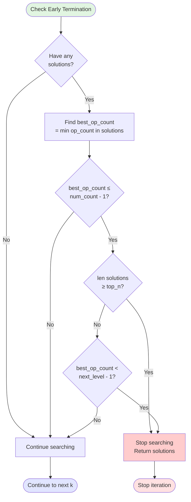

# Overall Algorithm Flow

This flowchart shows the high-level flow of the number combination solver.

## Main Algorithm Flow

## Early Termination Logic

## Algorithm Selection Logic

## Solution Deduplication Flow

## Canonical Key Generation

## normalise_mult_term Flow

## Performance Characteristics

| Component | Time Complexity | Space Complexity |
|-----------|----------------|------------------|
| **Overall (k≤4)** | O(n^k × o^(k-1)) | O(k + solutions) |
| **Overall (k>4)** | O(n^(k/2) × o^(k/2-1)) | O(n^(k/2) × o^(k/2-1)) |
| **Canonical key** | O(expression length) | O(expression length) |
| **Set operations** | O(1) average | O(solutions) |

## See Also

- [Algorithm Overview](../algorithm-overview.md) - High-level explanation
- [Direct Search Flow](direct-search-flow.md) - Direct search details
- [Meet-in-Middle Flow](meet-in-middle-flow.md) - Meet-in-middle details
- [Expression Evaluation](expression-evaluation.md) - Evaluation details
